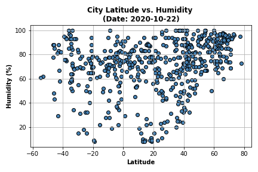
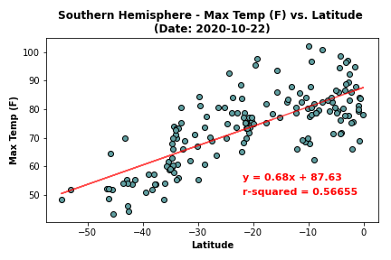
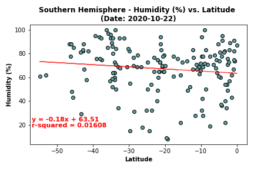
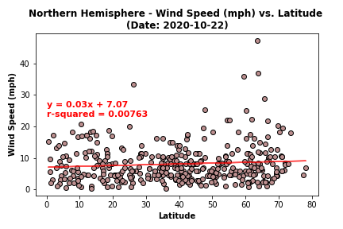
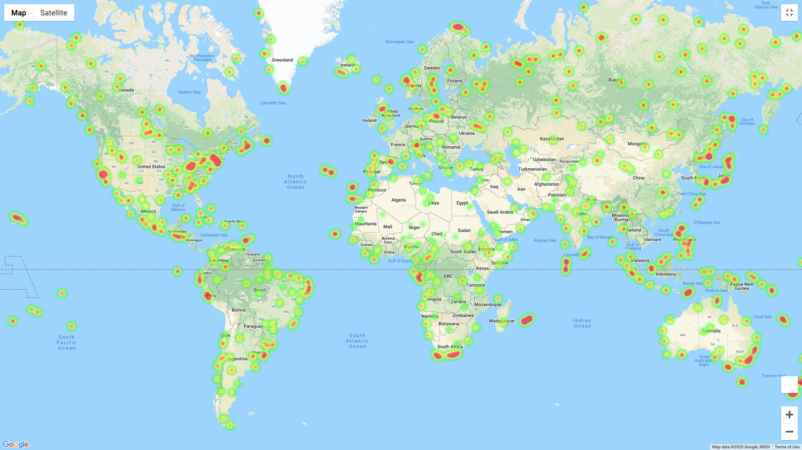

# What's the Weather Like?

Applying Python requests, APIs, and JSON into data analysis.

[WeatherPy](#weatherpy) | [VacationPy](#vacationpy)

## WeatherPy

[Analysis process](https://nbviewer.jupyter.org/github/abpuccini/python-api-challenge/blob/main/WeatherPy/WeatherPy.ipynb) (Jupyter Notebook)

### Background

As approaching the equator line, what is the weather like? The analysis will focus on the relationships between latitude and temperature(F), humidity(%), cloudiness(%), and wind speed(mph).

### Part I

*Focusing on the entire dataset.*

### Temperature (F) vs. Latitude

  

The scatter plot between city latitude and maximum (max) temperature(F) shows that cities located closer to the equator line, the max temperature tends to be higher than cities that are located further from the equator line. The reason is those cities are closer to the sun than the others. (Seasons and Why the Equator is Warmer than the Poles, *Pedagogy in Action*) 

---
### Humidity (%) vs. Latitude

  

The scatter plot between city latitude and humidity(%) shows the irrelevant relation of the city's location and percentage of humidity. Humidity in the air 

---
### Cloudiness (%) vs. Latitude

  

The scatter plot between city latitude and cloudiness(%) shows that there is no significant relation between city location and the density of clouds.

---
### Wind Speed (mph) vs. Latitude

  

The scatter plot between city latitude and wind speed(mph) shows that where cities are located is not related to the speed of wind. There are a few cities located between latitude 20 to 80 degrees where the wind speed is higer than others. However, the samples are small to make a conclusion that there is a relation between latitude and wind speed.

---
### Part II

*Comparison of Northern and Southern Hemisphere*

### Northern and Southern Hemisphere - Temperature (F) vs. Latitude

<table>
  <tr>
    <td></td>
    <td></td>
  </tr>
 </table>

As the figures presented, linear regression lines and correlation values between latitude (north and south) and maximum temperature which illustrate that city latitude has an effect on temperature. In the other word, city latitude is correlated to temperature. The linear regression line for the northern hemisphere is an inverse correlation which means the lower latitude (closer the equator line) in the northern area, the higher the temperature. On the other hand, the linear regression line for the southern hemisphere is positive correlation which means the higher the latitude (closer the equator line) in the southern area, the higher the temperature. Moreover, r-values represent the predictable temperature data based on latitude.

**Further Analysis**

The relation between temperature and other meteorological data; for example, humidity, wind speed or cloudiness, to discover other factors that affect the degree of temperature.

---
### Northern and Southern Hemisphere - Humidity (%) vs. Latitude

<table>
  <tr>
    <td>
    <td> 
</tr>
 </table>

As the figures presented, linear regression lines and correlation values between latitude (north and south) and percentage of humidity which illustrate the weak correlation between city location and humidity in that area. Also, the low r-squared values in both graphs indicate that this model might not be efficient in order to predict the humidity based on latitude.

**Further Analysis**

Humidity is the concentration of water vapor present in the air ("Humidity", *Wikipedia*). Therefore, the temperature might be one of the factors that causes the density of humidity. The correlation between humidity and temperature would be a further analysis.

---
### Northern and Southern Hemisphere - Cloudiness (%) vs. Latitude

<table>
  <tr>
    <td>
    <td> 
</tr>
 </table>

As the figures presented, correlation values between latitude (north and south) and percentage of cloudiness which illustrate the weak correlation between city location and cloudiness in that area. Linear regression lines and the low r-squared values in both graphs indicate that latitude might not be a significant factor that causes cloudiness.

**Further Analysis**

Other meteorological data,for example; temperature, might be considered to have more accurate analysis as an other variable to predict the cloudiness.

---
### Northern and Southern Hemisphere - Wind Speed (mph) vs. Latitude

<table>
  <tr>
    <td>
    <td> 
</tr>
 </table>

As the figures presented, correlation values between latitude (north and south) and wind speed (mph) which illustrate the weak correlation between city location and wind speed in that area. Also, the linear regression lines and low r-squared values in both graphs support that latitude data might not be a good indicator to predict wind speed.

**Further Analysis**

Wind is air in motion. It is produced by the uneven heating of the earth's surface by the sun ("Wind", *Weather Wiz Kids*). That implies that temperature might be a significant factor causing wind. The further analysis would be finding statistical data between temperature and wind speed and visualize it into a plot.

---
## VacationPy

### Humidity City Map

  

### Vacation Map

There are several places that are interesting to visit on the vacation period. Here is the map shown the cities with maximum temperature between 70 and 80 farenhite, wind speed less than 10 mph, zero percent cloudiness and humidity less than 70%.

  

---
© Atcharaporn B Puccini